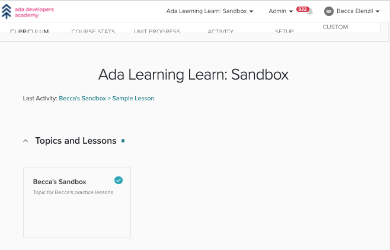

# Creating Content in GitHub

## Learning Learn Sandbox: Companion Learn Course

To practice creating content for Learn courses, we will use the [Ada Learning Learn: Sandbox course](https://learn-2.galvanize.com/cohorts/3188)

Request Instructor access to the [Ada Learning Learn: Sandbox course](https://learn-2.galvanize.com/cohorts/3188) and [corresponding respository](https://github.com/ada-developers-academy/ada-learning-learn-sandbox) from a Learn Admin.

## Summary of Terms

| Learn term      | GitHub Term |
| ----------- | ----------- |
| Unit     | Repository       |
| Topic   | Folder        |
| Lesson   | Markdown File      |

## Creating New Topics and Lessons

To start, we'll create a new Topic with your name in the title and one lesson (title of your choosing).

Nagivate to the [ada-learning-learn-sandbox repository]((https://github.com/ada-developers-academy/ada-learning-learn-sandbox)

### Add lesson

Select **Add file**, **Create new file**"

In the textbox the same `Name your file...`, type `yourname-topic/getting-started.md` to created a new folder with one new file.

Then add content to the file.

### Preview lesson

We can **Preview** the file to see the rendered Markdown.

### Save lesson

To save our work, we scroll down to the bottom of the screen to the **Commit** section, write a meaningful message in the first input box, and click the green button: **Commit new file**.

## Markdown

One of the most useful pieces of markdown syntax is for adding a link.

We can add a link with the following syntax. 

syntax: `[github](github.com)`
result: [github](http://github.com)

Give it a try in your sample file/lesson.

At this time, we have outsourced the training for writing Markdown to [this guide](https://www.markdownguide.org/). Please share other useful resources you find!

## What's Next

Next we will learn how to publish our course on Learn.