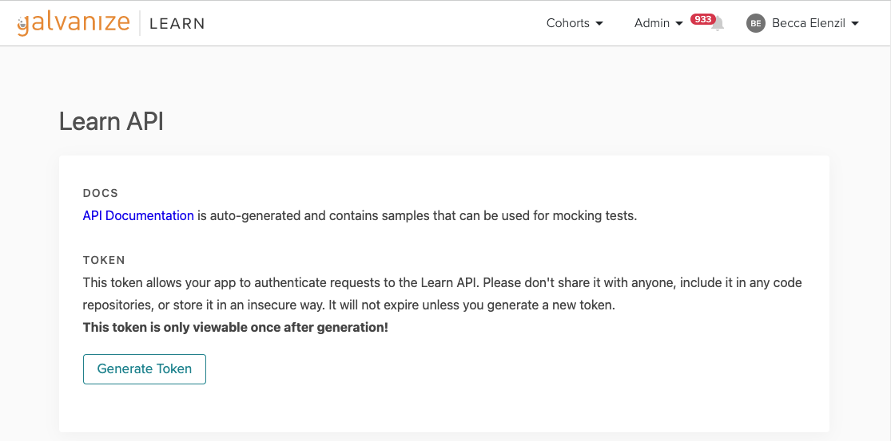
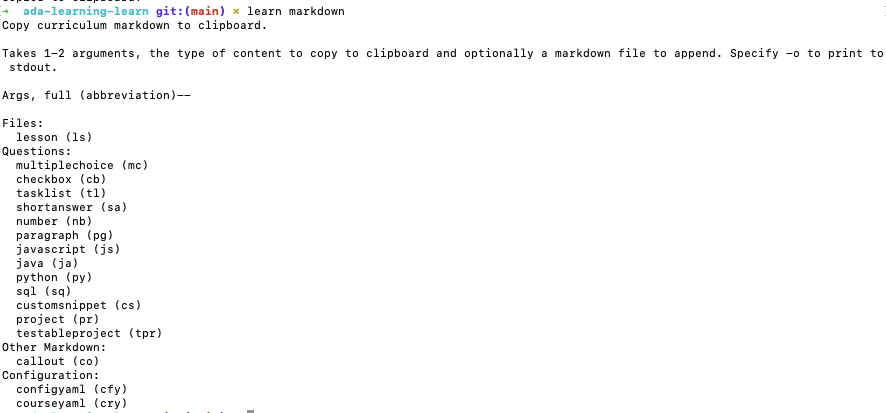

# Interactive Lessons in Learn

Learn provides a flavor of markdown that allows us to write interactive content including, but not limited to:
- multiple choice questions
- short/long answer questions
- an interactive task list

<!-- available callout types: info, success, warning, danger, secondary  -->
### !callout-info

## Highlighted Content
We can also write highlighted content like this!

### !end-callout

## Sample Interactive Challenges

<!-- >>>>>>>>>>>>>>>>>>>>>> BEGIN CHALLENGE >>>>>>>>>>>>>>>>>>>>>> -->
<!-- Replace everything in square brackets [] and remove brackets  -->

### !challenge

* type: multiple-choice
* id: 5deb4c98-6dc8-4613-85d7-64287458b221
* title: Sample Multiple Choice Question
<!-- * points: [1] (optional, the number of points for scoring as a checkpoint) -->
<!-- * topics: [python, pandas] (optional the topics for analyzing points) -->

##### !question

What is the Learn term that corresponds to a Repository

##### !end-question

##### !options

* Unit
* Topic
* Lesson

##### !end-options

##### !answer

* Unit

##### !end-answer

### !end-challenge

<!-- ======================= END CHALLENGE ======================= -->


<!-- >>>>>>>>>>>>>>>>>>>>>> BEGIN CHALLENGE >>>>>>>>>>>>>>>>>>>>>> -->
<!-- Replace everything in square brackets [] and remove brackets  -->

### !challenge

* type: paragraph
* id: 873d41a3-f12a-43c2-b7c9-ea1f564db45f
* title: Sample Long Answer
<!-- * points: [1] (optional, the number of points for scoring as a checkpoint) -->
<!-- * topics: [python, pandas] (optional the topics for analyzing points) -->

##### !question

What's your favorite thing about Learn?

##### !end-question

##### !placeholder

My favorite thing about Learn is...

##### !end-placeholder

<!-- other optional sections -->
<!-- !hint - !end-hint (markdown, hidden, students click to view) -->
<!-- !rubric - !end-rubric (markdown, instructors can see while scoring a checkpoint) -->
<!-- !explanation - !end-explanation (markdown, students can see after answering correctly) -->

### !end-challenge


<!-- >>>>>>>>>>>>>>>>>>>>>> BEGIN CHALLENGE >>>>>>>>>>>>>>>>>>>>>> -->
<!-- Replace everything in square brackets [] and remove brackets  -->

### !challenge

* type: tasklist
* id: bbb9b809-7e2e-4475-aa86-002fe5327154
* title: Sample TaskList
<!-- * points: [1] (optional, the number of points for scoring as a checkpoint) -->
<!-- * topics: [python, pandas] (optional the topics for analyzing points) -->

##### !question

Complete the following tasks:

##### !end-question

##### !options

* Create a GitHub Repository
* Make the first 
* Go to bed

##### !end-options

<!-- other optional sections -->
<!-- !hint - !end-hint (markdown, hidden, students click to view) -->
<!-- !rubric - !end-rubric (markdown, instructors can see while scoring a checkpoint) -->
<!-- !explanation - !end-explanation (markdown, students can see after answering correctly) -->

### !end-challenge

<!-- ======================= END CHALLENGE ======================= -->

## Learn Command Line Interface (Learn CLI)

To generate the markdown for Learn interactive questions, like those above, we will want to use to Learn CLI tool.

First, you will need an API Token. Go [here](https://learn-2.galvanize.com/api_token) and click **Generate Token**



To install the Learn CLI tool, we will need a utility called homebrew. 

To install homebrew, open up the **Terminal** (../assets/terminal.png) application on your Mac and paste the following command. Press **Enter** to run command.

```bash
/bin/bash -c "$(curl -fsSL https://raw.githubusercontent.com/Homebrew/install/HEAD/install.sh)"
```

Then, to install the Learn CLI, run the following commands:

```bash
brew tap gSchool/learn

brew install learn

learn set --api_token=YOUR_LEARN_API_TOKEN
```

## Learn markdown

To generate the markdown scaffold for a multiple choice question, we run the command `learn markdown mc`

The scaffold for a Multiple Choice queston will be copied to our clipboard.

We can paste this text into our markdown file/lesson in GitHub and modify with the appropriate content for our question.

To see all available Learn markdown scaffolds available, enter the command `learn markdown` in the Terminal.



The `shortanswer (sa)`, `tasklist (tl)`, `paragraph (pg)`, and `checkbox (cb)` (multiple answer, multiple choice question) question scaffolds are generated with the following commands:
* learn markdown sa
* learn markdown tl
* learn markdown pg
* learn markdown cb

Add one of each of these types of questions to your sample Learn lesson.

## What's Next

Next we will learn how to publish curriculum in Learn.