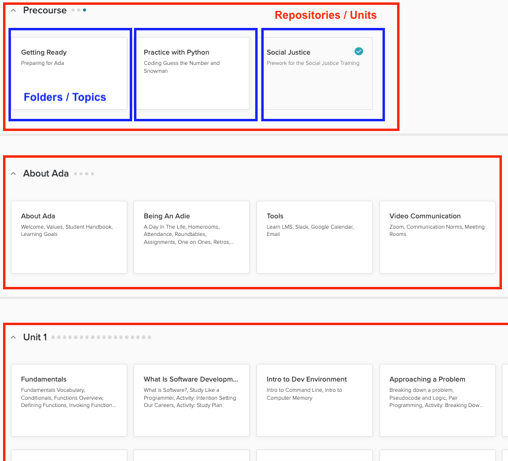

# GitHub and Learn Organization

## Intro

GitHub is a code hosting platform for version control and collaboration. It lets you and others work together on projects from anywhere.

This training will go over the basics of GitHub needed to create and contribute to curriculum hosted on Learn. GitHub provides a [quickstart guide](https://docs.github.com/en/get-started/quickstart/hello-world) if you'd like to go deeper.

## GitHub Account

Create an account on [GitHub](https://github.com/signup)

## Organization

### Repositories / Units

A GitHub Repository corresponds to a **Unit** in Learn. 

For example, **Precourse**, **About Ada**, and **Unit 1** are all Units in the Ada Core curriculum.

A single Learn course can be made up of one or more Units/Repositories. To create a new Unit, ask a Learn Admin to create a new repository for you.

### Folders / Topics

We can see how one of these units, **Precourse**, looks in GitHub:

Notice that each of the folders in the GitHub repository correspond to a **Topic** in Learn. 

### Files / Lessons

In each folder, there are ""Markdown** files (i.e. filename.md) that correspond to the lessons in Learn. 

Learn lessons are written in **Markdown**. Markdown is a lightweight markup language that you can use to add formatting elements to plaintext text documents. [(source)](https://www.markdownguide.org/getting-started/)

Below we can see what the raw Markdown looks like for the **Introduction and Getting Started** lesson shown above.

## Publishing to Learn

The order of the Topics in a Unit in Learn is prescribed by another document, the `config.yaml` file. 

Below is the `config.yaml` for this Unit. 

Work with a Learn Admin to create the `config.yaml` for the Unit(s) in your course.

## Summary

| Learn term      | GitHub Term |
| ----------- | ----------- |
| Unit     | Repository       |
| Topic   | Folder        |
| Lesson   | Markdown File      |

## What's next

Next we will learn how to create folders (topics) and files (lessons) in a GitHub respository (unit).

