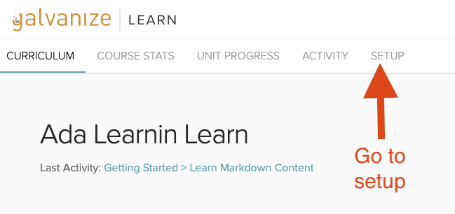
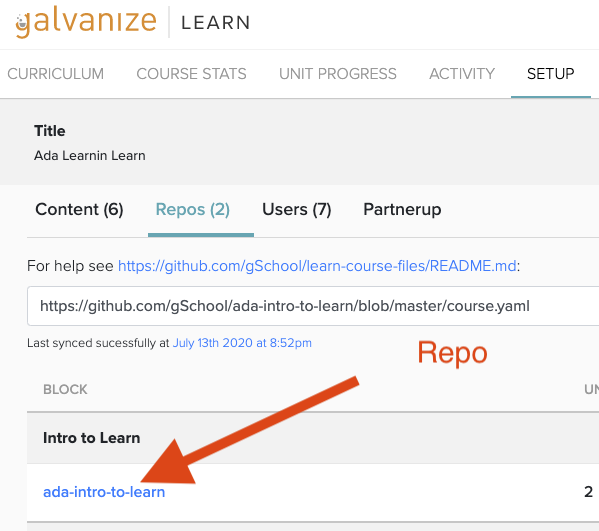
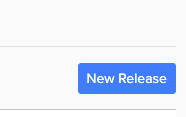
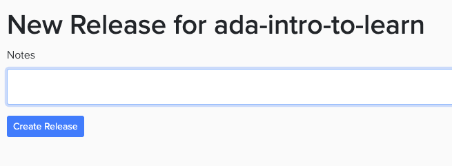

# Publishing Curriculum

To publish the lessons we write in GitHub on Learn, we need to create a **New Release** of the repository (curriculum block) in Learn.

To create a new release we go to the course' setup page and click on the repo in question.

Then click on the repo in question

Then click on **New Release** to on the top-right and create a new release, notes are optional

Then we can revist the course material and see your changes.

Give it a try for our sample Unit in the **Ada Learning Learn: Sandbox** course.

## What's Next

Ask a Learn Admin to partner with you to create a new repository and Learn course for your curriculum!