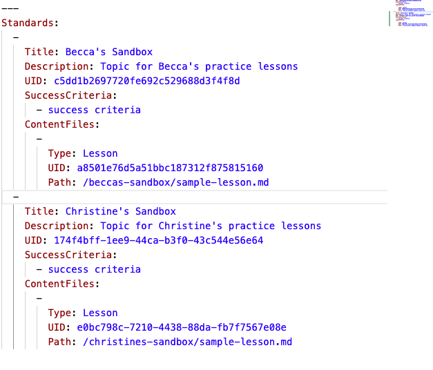

# Publishing Curriculum

## config.yaml

To include new Topic (folders) and Lessons (files) in a Learn course, we need to update the `config.yaml`. 

We will need a new section for a new entry under `Standards:` for a new topic, and a new entry under `ContentFiles:` for new lesson.

Each topic and each lesson will need a unique `UID`. We can generate that `UID` with an [online UUID Generator](https://www.uuidgenerator.net/)

For example, an updated `config.yaml` that include's Christine's sample lesson might look like this:

## New Release

To publish the lessons we write in GitHub on Learn, we need to create a **New Release** of the repository (curriculum block) in Learn.

To create a new release we go to the course' setup page and click on the repo in question.

Then click on the repo in question

Then click on **New Release** to on the top-right and create a new release, notes are optional

Then we can revist the course material and see your changes.

Give it a try for our sample Unit in the **Ada Learning Learn: Sandbox** course.

## What's Next

Next, we'll learn how to make interactive questions using the Learn Command Line Interface (CLI) tool.