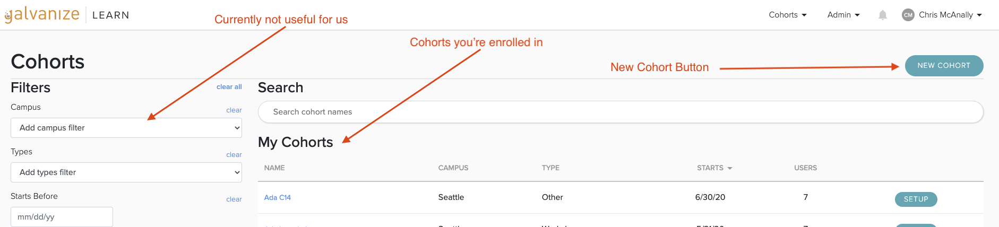
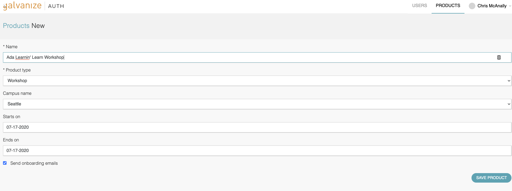
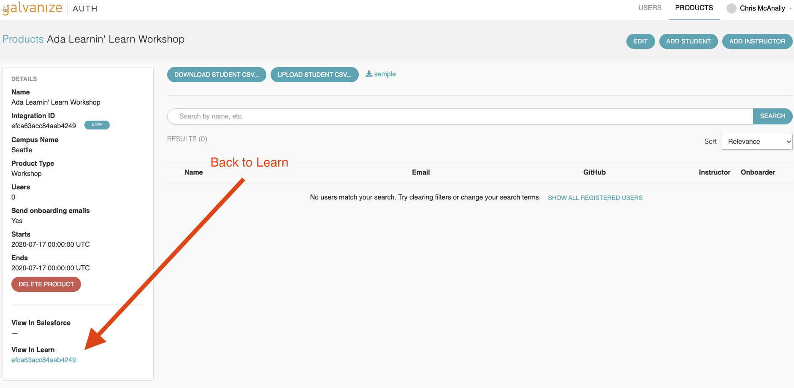

# LEARN ADMINS: Creating a Cohort

In this lesson we will create a sample course in Learn and enroll students.

In Learn, the term for course is Cohort.

## Creating a Cohort in Learn

Go to the [Learn Cohorts page](https://learn-2.galvanize.com/cohorts) and Create a new sample cohort.  

<!-- available callout types: info, success, warning, danger, secondary  -->
### !callout-danger

## Naming Convention

I strongly suggest we start any cohort we create in Learn with the name "Ada" to make them easier to find and distinguish from Galvanize.

### !end-callout

Then fill out the form.

You can enroll students and teachers individually with the buttons, and enroll students in-bulk with a CSV file via a template. 

Notice that this brings you to Auth, which is a tool to link users with products for Galvanize.

## Exercise

Enroll your pair as an instructor in the course.  Then add the other instructors as students.

## Back to Learn

You can find a link to your course either in the products page, or with the link at the bottom right.

